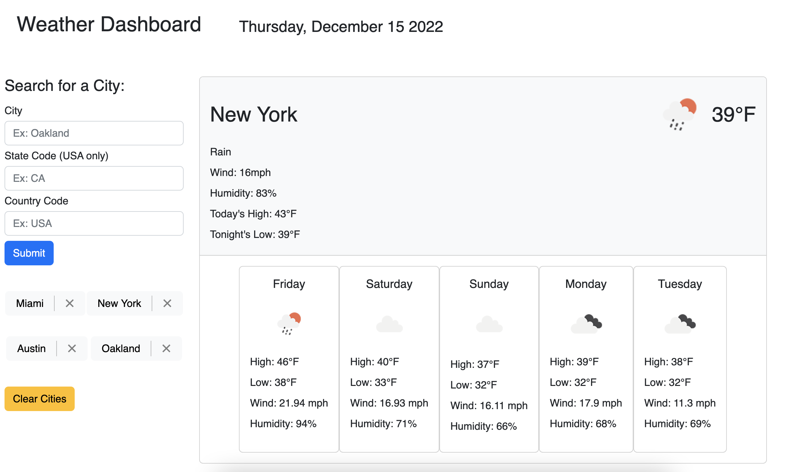

# weather-forcast

## Description

This is appplication allows users to lookup weather conditions for cities around the globe and save cities for easy access. This application was designed to help individuals plan their day or week around the weather. 

## Installation

No installation necessary. Just open the following link in a web browser with internet connection.

https://danwillett.github.io/weather-forecast/

## Usage

To use this application, first enter a city in the search form. The cityn name is required. US state and country are optional entries, however recommended. After submitting your search, the city's weather conditions will be loaded and displayed if the city is registered in the openweather catalog.

Once a city has been searched, it will populate as button beneath the search form for easy access. When you click the button, the city's weather will be loaded. You can remove a city from the search history by clicking the 'X', or you can remove all of your search history by pressing the 'Clear Cities' button.

## Credits

### CSS and JS Libraries:

Boostrap version 5.2.3: https://getbootstrap.com/
Jquery version 3.6.1: https://jquery.com/
DayJS: https://day.js.org/

### APIs

Openweather: https://openweathermap.org/
- Current Weather Data
- 5 Day/ 3 Hour Forecast
- Geocoding

## License

MIT